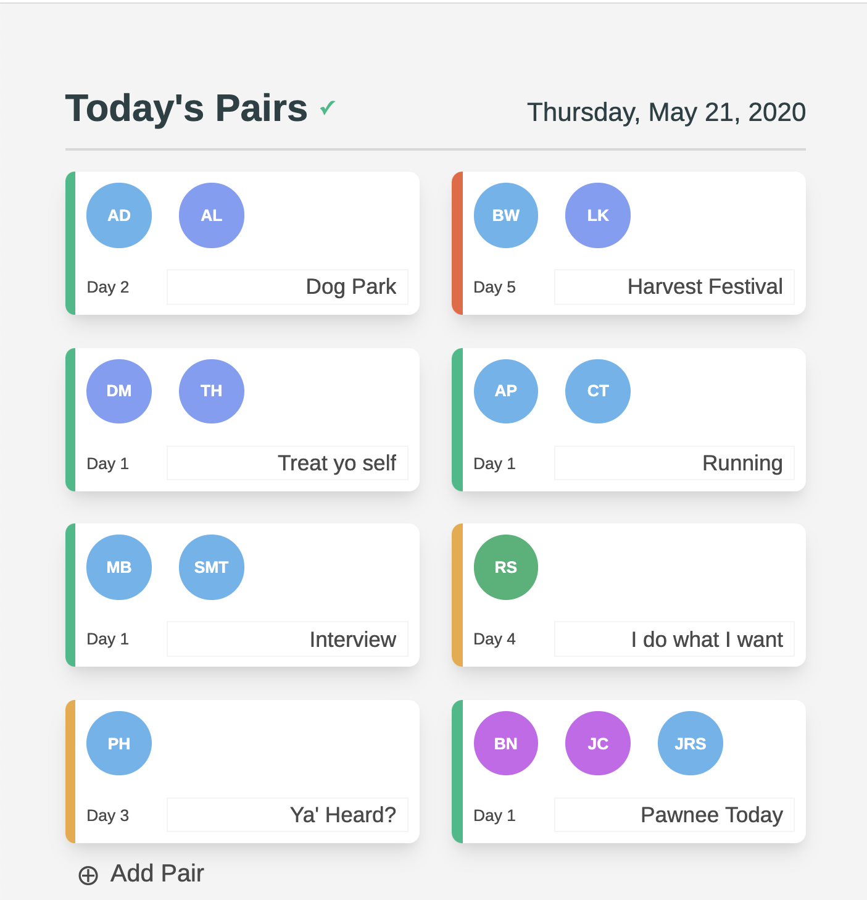
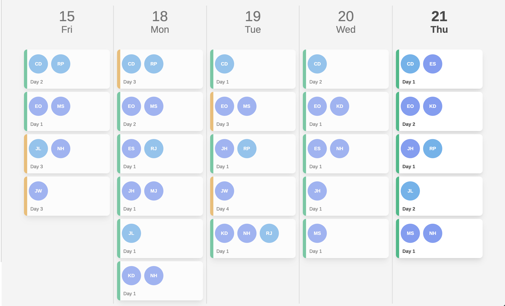
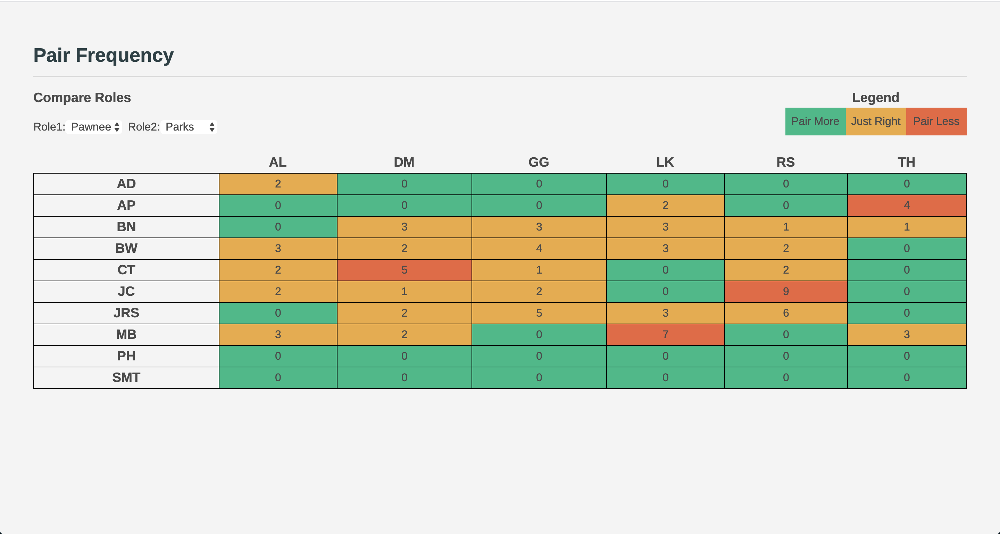

Pairamid-Dom provides the frontend for [pairamid.com](https://pairamid.com). A web application to facilitate optimal pair programming, team collaboration, and situational awareness. Key metrics tracked:

- pair frequency
- cross functional metrics
- pair duration
- pair history
- pair feedback

## Screenshots

## Development

This project was bootstrapped with [Create React App](https://github.com/facebook/create-react-app).

1. This application bas been built to run with with the python/flask [pairamid-api](https://github.com/erikolsen/pairamid-api).
